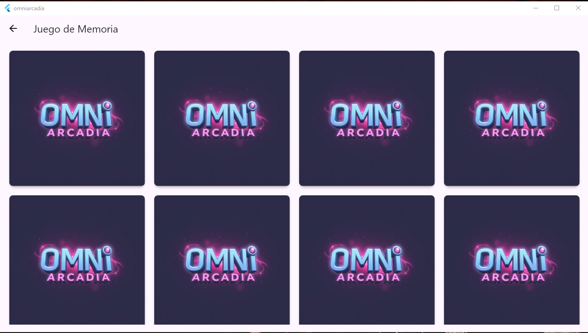
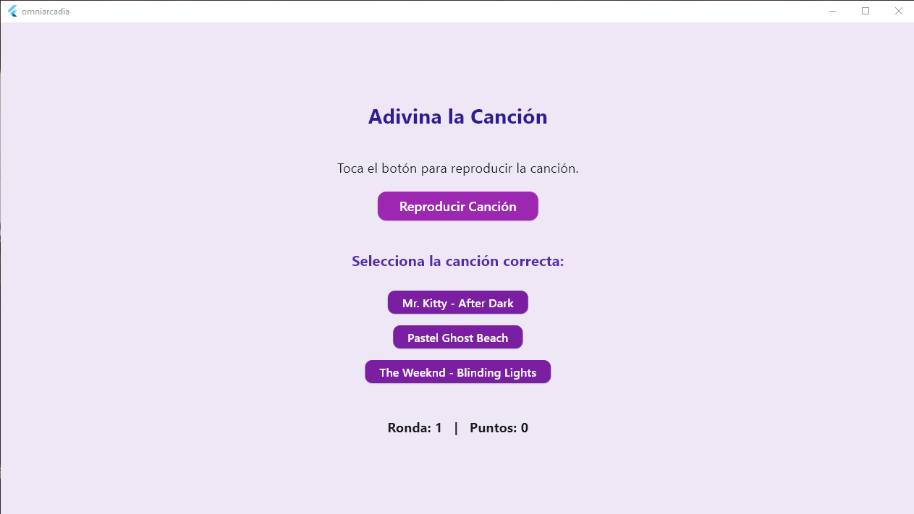
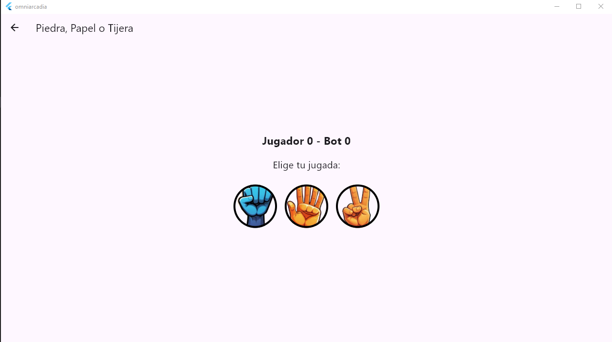

# 📱 OmniArcadia

**OmniArcadia** es una app Android hecha en **Flutter** que reúne varios minijuegos simples y divertidos.
Ideal como portfolio para mostrar manejo de UI, audio, estados y navegación en Flutter.

---

## 🎮 Minijuegos incluidos

- 🧠 **Juego de Memoria**
  - Cartas con imágenes emparejadas
  - Animación de volteo
  - (Opcional) Sonidos al voltear / acertar / ganar

- 🎵 **Adivina la Canción**
  - Reproduce un fragmento y elegí entre 3 opciones
  - Pausa automática al acertar
  - Diseño centrado y feedback visual

- ✊ **Piedra, Papel o Tijera**
  - 1 vs Bot (mejor de 3)
  - Resalta la selección de jugador y bot
  - Marcador de rondas y resultado (Ganaste / Perdiste / Empate)

---

## 🖼️ Capturas
> Memoria:


Adivina la Canción:


Piedra, Papel o Tijera:


---

## 🛠️ Tecnologías
- Flutter (Dart)
- just_audio (para música)
- video_player
- Material Design y widgets personalizados

## 📂 Estructura del proyecto

OmniArcadia/
│── lib/
│   ├── main.dart            # Punto de entrada
│   ├── screens/             # Pantallas de los minijuegos
│   │   ├── memory_game.dart
│   │   ├── music_quiz.dart
│   │   ├── rps_game.dart    # Piedra, papel o tijera
│   ├── widgets/             # Componentes reutilizables
│
│── assets/
│   ├── images/              # Imágenes para el juego de memorias
│   ├── music/               # Fragmentos de audio para el quiz musical
│
│── pubspec.yaml             # Configuración de dependencias
└─ README.md

## ⚙️ Configuración de assets (pubspec.yaml)

```yaml
flutter:
  uses-material-design: true
  assets:
    - assets/images/piedra.png
    - assets/images/papel.png
    - assets/images/tijera.png
    - assets/images/back_card.png
    - assets/images/A.png
    - assets/images/B.png
    - assets/images/C.png
    - assets/images/D.png
    - assets/music/afterdark_8bit.mp3
    - assets/sounds/flip_card.mp3
    - assets/sounds/correct_match.mp3
    - assets/sounds/win_game.mp3

🚀 Cómo ejecutar

    git clone https://github.com/Ezequiel208/omniarcadia.git
    cd omniarcadia
    flutter pub get
    flutter run

    🧭 Navegación

Pantalla de selección (game_selection.dart) → navega a cada minijuego.

Cada pantalla tiene botón de volver en el AppBar.

🗺️ Roadmap

Nuevos minijuegos (trivia, puzzle, arcade simple)

Tabla de puntajes

Temas/skins y más sonidos

🛠️ Próximas mejoras

Agregar sistema de puntuaciones.

Nuevos minijuegos retro.

Guardado de progreso.

👤 Autor

Desarrollado por Ezequiel Paez

https://github.com/Ezequiel208

